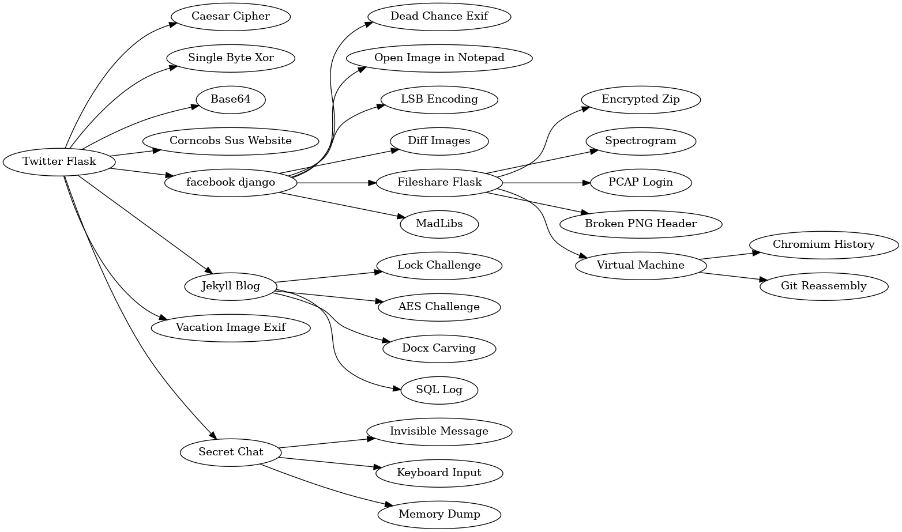

Chalgen Docs
==============
## Links
  - [All challenges](chal_types/README.md)
  - [Concepts explained](README.md#concepts-explained)
  - [Example commands](README.md#available-commands)
  - [Running on AWS](README.md#run-a-competition-on-an-aws-lab)

## Concepts explained

### Challenges
A challenge is represented by a YAML file like the following:

```yaml
- !ext4_file_recovery
  name: "Ext4 File Recovery"
  flag: "flag{this_is_a_test}"
  config:
    deleted_evidence: evidence
    fluff: fluff
```

The type of challenge is determined by the YAML tag (starts with a !). Values in the `config` field allow you customize the challenge to your competition.

### Challenge environments
Challenge environments host other challenges and can also be configured to fit the competition. They have the same fields as Challenges but also "link" to other challenges through the `chals` subfield. An example is shown below.

```yaml
- !jekyll_blog
  name: Jekyll Blog
  flag: "flag{test}"
  config:
    meta:
      title: Chance's Cooking Blog!
    posts:
    - 2014-06-08-post1.md
    - 2014-06-08-post2.md
    chals:
      - Vigenere
      - Docx Carving
```

Challenges link through the `name` field. Challenge environments can't be made/run through the `python main.py gen` command, so you must use `python main.py comp gen`. 

### Competition structure
Competitions are structured in a tree-like fashion, with some Challenge Environments serving as entrypoints. An example structure is shown below. In this case, Fesbuc is an entrypoint.



A competition folder has a `config.yaml` that specifies the entrypoints and `chals` folder that contains the challenges. You can look at the example in [/competitions/middle-school-teaser-2021](/competitions/middle-school-teaser-2021/)

## Available commands
***
### Run the Competion Creator GUI

```shell
python main.py gui -f <relative path of the competition folder>
```

After running the above command, a GUI will pop up to help scaffold your competition. You can create a challenge map and after clicking 
create competition files, a folder with all the nessecary YAML files will be created. You cab edit these YAML file to customize your competition.
***
### Generate a single challenge

```shell
python main.py chal gen -c <relative path of the challenge YAML>
```

This command generates all the files for challenges and builds the docker image if needed.
***
### Run a single challenge

```shell
python main.py chal run -c <relative path of the challenge YAML>
```

This command runs the docker image for local testing. You must run `python main.py chal gen` before in order to create all the files and build.
***
### Build a competition for Kubernetes

```shell
python main.py comp gen -f <relative path of the competition> -r <registry to push images to>
```

This command builds all of the Kubernetes files needed to deploy to a prexisting Kubernetes cluster. Upon completion, a graph of the challenges will be generated. The graph will be located at `evidence_graph.png` file in the competition folder.

### Build and run a competition locally

```shell
python main.py comp gen -f <relative path of the competition> -l
```

This command assumes you have `minikube` installed. Install it [here](https://minikube.sigs.k8s.io/docs/start/). This command runs the competition using minikube for local testing. Remember to add `127.0.0.1:53` as a DNS server. The urls of the challenges will be located in the `zones.txt` file.
***

## Getting an entire competition running on Google Cloud

1. Obtain a domain name with a wildcard SSL certificate
2. Create a Google Cloud account 
3. Create a project in Google Cloud
    - Go to the 
    - Click on the dropdown next to the Google Cloud logo and select "New Project"
    - Give your project a name and click "Create"
4. Use the Codespaces button in our repo to create a new Codespace OR install the Pre-reqs and clone the repo.
    - Install the Google Cloud SDK  if running locally
5. Run `gcloud auth login` and follow the instructions to login to your Google Cloud account
6. Create a Kubernetes cluster in Google Cloud
    - `gcloud container clusters create <cluster-name> --num-nodes=<number of node> --zone=<zone>`
    - You can change the zone to any of the zones listed 
    - You can change the number of nodes to any number you want
7. Get the credentials for your cluster
    - `gcloud container clusters get-credentials <cluster-name> --zone=<zone>`
8. Run `python main.py comp gen -f <relative path of the competition> -r <registry to push images to>`
    - Docker Hub is a free registry to use, check it out 
        - All images will be public, however, so you may want to create a private repo
    - You can also use a private registry, check out the instructions 
    - Once you create a private registry, you will need to run `gcloud auth configure-docker` to authenticate with your registry
9. Update your domain's DNS records to point to the ingress IP address of your cluster
    - Run `kubectl get ingress -n challenges` to get the IP address
    - Update your domain's DNS records to point to the IP address

